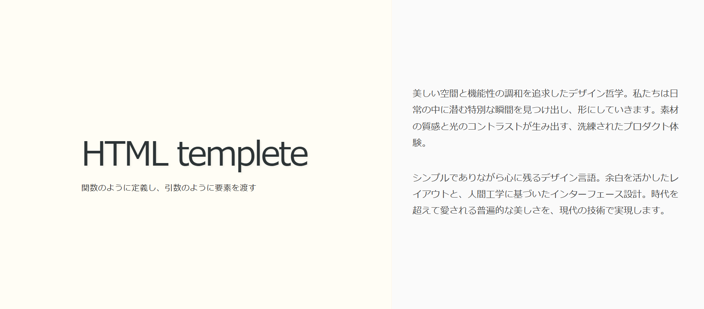

# tiny_css

## what is good design?

This CSS came from us chasing that perfect balance—obsessed with nailing those sweet margins and contrast vibes.

無駄がなく、簡潔で見やすい。

そして、コンテンツを引き立てる。

そのようなデザインをよいデザインだと定義しました。

It's got that Japanese-style harmony going on—everything in perfect balance, yet so naturally composed.

和のようなバランスの取れたデザインだと思います。

以下の文章は適当につけたものなので、気にしないでください。

